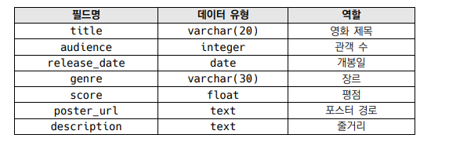

# PTJ 05


<div style="text-align: right"> 대전_3반_김동완</div>

## 이번 ptj를 통해 배운 내용

1. 데이터를 생성하고, 조회, 수정, 삭제(CRUD)가 가능한 Web Application을 제작할 수 있었습니다. 
2. Django web framework를 통한 데이터를 조작할 수 있었습니다. 
3. ORM을 통한 데이터 핸들링을 할 수 있었습니다. 
4. 관리자 페이지를 통한 데이터 추가, 수정, 삭제를 할 수 있었습니다. 
5. Bootstrap을 통한 html 꾸미기가 가능했습니다. 


### 개발도구

- VSCode
- Google Chrome Browser
- Bootstrap v5
- Django 3.2+

### 요구사항 

커뮤니티 서비스의 게시판 기능 개발을 위한 단계로, 영화 데이터의 생성, 조회, 수정, 삭제 가능
한 어플리케이션을 완성합니다. 해당 기능은 향후 커뮤니티 서비스의 필수 기능으로 사용됩니다.
아래 기술된 사항들은 필수적으로 구현해야 하는 내용입니다.
django 프로젝트 이름은 pjt05, 앱 이름은 movies로 지정합니다. 

## A.Model

정의할 모델 클래스의 이름은 Movie이며, 다음과 같은 정보를 저장합니다.



### 결과

- 문제 접근 방법 :varchar은 옵션에 따라 최대 글자를 조정하고, 익숙하지 않은 데이터 유형은 django Modle field reference를 참고해서 해결하자. 

- code

  ``` python
  #models.py
  
  from django.db import models
  
  # Create your models here.
  
  class Movie(models.Model) :
      
      #영화제목
      title = models.CharField(max_length=20)
      #관객 수
      audience = models.IntegerField()
      #개봉일
      release_date= models.DateField()
      #장르
      genre = models.CharField(max_length=30)
      #평점
      score = models.FloatField()
      #포스터 경로
      poster_url = models.TextField()
      #줄거리
      description = models.TextField()
  
      def __str__(self):
          return f'제목: {self.title} / 평점:{self.score}'
  
  #admin.py
  from django.apps import AppConfig
  
  
  class MoviesConfig(AppConfig):
      default_auto_field = 'django.db.models.BigAutoField'
      name = 'movies'
  
  ```
  
- 해결 방식 

  1. Movieclass를 만들어 각 항목마다 어울리는 필드를 입력했습니다.
  1. migration으로 sql에 정보를 전달했습니다.  
  1. createsuperuser를 이용해 관리자 계정을 만들었습니다. 
  2. \_\_str__을 이용해서 admin 페이지에서 보여줄 내용을 구성했습니다. 
  
- 이 문제에서 어려웠던 점

- 내가 생각하는 이 문제의 포인트

  - 클래스 생성 
  - 관리자 계정 만들기
  - migration
  
- 이 문제의 느낀점

  - 지난 과제를 복기하다 보니 금방 해결할 수 있었습니다. 

## B. Template

#### 요구사항 : 

i. 공유템플릿 이용하기

### base.html

- 기본 html 구성을 하고, 부트스트랩 요소를 추가했습니다.  

  ``` html
  <!DOCTYPE html>
  <html lang="en">
  <head>
    <!-- CSS only -->
    <link href="https://cdn.jsdelivr.net/npm/bootstrap@5.1.3/dist/css/bootstrap.min.css" rel="stylesheet" integrity="sha384-1BmE4kWBq78iYhFldvKuhfTAU6auU8tT94WrHftjDbrCEXSU1oBoqyl2QvZ6jIW3" crossorigin="anonymous">
    <meta charset="UTF-8">
    <meta http-equiv="X-UA-Compatible" content="IE=edge">
    <meta name="viewport" content="width=device-width, initial-scale=1.0">
    <title>Document</title>
  
  </head>
  <body>
  
  
  
   
  <!-- JavaScript Bundle with Popper -->
  <script src="https://cdn.jsdelivr.net/npm/bootstrap@5.1.3/dist/js/bootstrap.bundle.min.js" integrity="sha384-ka7Sk0Gln4gmtz2MlQnikT1wXgYsOg+OMhuP+IlRH9sENBO0LRn5q+8nbTov4+1p" crossorigin="anonymous"></script>
  </body>
  </html>
  ```


### index.html

```python
path('',views.index,name= 'index'),
```

```python
def index(request) :
    #sql에 저장된 모든 영화 정보를 쿼리형태로 가져온다. 
    movies = Movie.objects.all()
    #context에 영화정보를 넣어 index.html에 전달한다. 
    context = {
        'movies' : movies
    }
    return render(request,'movies/index.html',context)

```

```html




   영화 게시판 목록을 보여줄 페이지  
  <h1>INDEX</h1>
   하이퍼링크로 표시된 NEW를 클릭하면 새로운 게시물을 작성할 수 잇게 movies:new를 실행한다. 
  <a href="">NEW</a>
  <br>
  <br>
   모든 movies 데이터를 돌며 한개의 영화씩 영화 제목과 평점을 표시한다.  
  
   영화 제목을 클릭하면 movies:detail을 실행하여 영화의 세부 정보를 볼 수 있다.  
    <a href="">{{movie.title}}</a>
    <p>평점: {{movie.score}}</p>
    <hr>
  


```

- 해결 방식 
  1. app_name을 'movies'로 입력한 후 templates 폴더 내부에 movies 폴더를 추가로 등록해 앱을 추가로 생성했을 때 name_space 에러를 방지했습니다. 
  2.  sql에 admin계정을 이용해 dummy 데이터를 입력했습니다.
  3. movies에 movie class에 있는 모든 데이터를 저장한 후 context에 저장해서 html에 넘겨주게 설계했습니다.
  4. INDEX 페이지를 설계할 때는 받아온 movies를 순회하며 각 영화의 제목과 평점을 표시하게 했습니다.
  5. new 하이퍼링크를 생성해 추후 새로운 게시글을 생성할 준비를 했습니다.
  6. 각 영화 제목에 하이퍼링크를 줘서 영화의 세부정보에 접근할 수 있게 했습니다. 
- 이 문제에서 어려웠던 점
- 내가 생각하는 이 문제의 포인트

  - 데이터를 함수를 이용해 movies에 저장하고 html에 전달
  - html에서 반복문 사용 
- 이 문제의 느낀점

  - 상대경로로 접근하는 것과 url로 접근하는 것의 차이를 느꼈습니다. 


### detail.html

``` python
path('<int:pk>/',views.detail,name='detail'),
```

```python
def detail(request,pk) :
    #영화 상세정보를 볼 수 있는 페이지므로 각 영화 게시글별로 고유한 pk값을 같이 받는다. 
    movie = Movie.objects.get(pk=pk) 
    #pk값을 바탕으로 하나의 영화 인스턴스를 movie에 저장한다.
    context = {
        'movie' : movie,
    }

    #해당 영화 정보를 가진 detail.html을 반환한다. 
    return render(request,'movies/detail.html',context)
```

```html




   영화 세부정보를 표시하는 DETAIL 페이지이다.  
  <h1>DETAIL</h1>
   poster_url을 이용하여 이미지를 표시한다.  
  
  <hr>
   다양한 영화 세부정보를 varible routing을 이용해서 표현한다. 
  <p>{{movie.title}}</p>
  <p>Audience : {{movie.audience}}</p>
  <p>Release Dates : {{movie.release_date}}</p>
  <p>Genre : {{movie.genre}}</p>
  <p>Score : {{movie.score}}</p>
  <p>Description : {{movie.description}}</p>
   <a href="">EDIT</a> 
   수정, 삭제, 뒤로가기 버튼을 생성한다.  

   삭제는 POST 기능으로 전달해야하기 때문에, form 형태로 만들되 형식을 맞추기 위해 bootstrap의 기능을 이용해
  a태그를 사용한 것과 같이 만들고, flex와 align-items-center를 이용해 행열을 맞춰준다.  
  <div class="d-flex align-items-center">
     movies:edit를 실행하고 현재 영화의 pk값을 전달한다.  
      <a href="">EDIT</a>
     movies:delete를 실행하고 현재 영화의 pk값을 전달한다.  
    <form action="" method = 'POST'>
      
      <button class="btn btn-link">DELETE</button>
    </form>

  </div>
   back을 누르면 movies:index를 실행해서 메인페이지로 돌아간다.  
  <a href="">BACK</a>

```

- 해결 방식 
  1. detail.html은 하나의 html에 variable routing을 이용해 다른 정보를 표시하게 설계했습니다. 
  1. views에서 detail 함수는 index에서 클릭시 pk값을 함께 받도록 설계했으며, 해당 pk 값의로 movie라는 변수에 정보를 담게 한 후 context에 저장하게 했습니다. 
  1. html에서는 img기능을 이용해 주소로 포스터 이미지를 표시하게 했습니다.
  1. 또한 변수기능을 이용해 영화의 각 세부정보를 표시하게 했습니다. 
  1. a태그를 이용해 메인페이지로 돌아가거나 edit을 이용한 수정 html 전달 구현을 준비했습니다.
  1. delete는 redirect와 url에 표시하지 않기 위해 post로 값을 전달했습니다. 
  1. 추후 API를 이용해 영화 제목만으로 정보를 불러오는 기능을 구현할 예정입니다. 
- 이 문제에서 어려웠던 점 

  - button 정렬 
- 내가 생각하는 이 문제의 포인트

  - 다른 html에서 url을 이용해 정보를 전달하고 함수를 통해 받아오기 
- 이 문제의 느낀점

  - 수정, 삭제가 비슷해보여도 구현하려하는 방식에 따라 다를수 있다. 

## new.html

```python
path('new/',views.new,name='new'),
path('create/', views.create, name='create'), 
```

```python
def new(request) :
    #새로운 영화게시글을 만들 new.html을 실행한다. 
    return render(request,'movies/new.html')

def create(request) :
    #new에서 넘어온 데이터를 바탕으로 각 항목에 매핑한다. 
    title = request.POST.get('title')
    audience = request.POST.get('audience')
    release_date = request.POST.get('release_date')
    genre = request.POST.get('genre')
    score = request.POST.get('score')
    poster_url = request.POST.get('url')
    description = request.POST.get('description')

    #movie인스턴스를 생성 후 
    movie = Movie()
    # 각 값을 대입하고
    movie.title=title
    movie.audience = audience
    movie.release_date = release_date
    movie.genre = genre
    movie.score = score
    movie.poster_url = poster_url
    movie.description = description
    #저장한다. 
    movie.save()
    #함수 실행이 끝나면 메인페이지로 돌아간다. 
    return redirect('movies:index')
```

```html




 새로운 영화 정보를 등록하는 NEW페이지  
  <h1>NEW</h1>
  <hr>

   폼 형태로 데이터를 movies:create url로 전송하며 POST형태로 전송하여 작성된 글이 url에 표시되지 않도록 한다.  
  <form action="" method="POST">
    
     영화 정보는 text타입으로 받는다.  
    <label for="title">TITLE</label>
    <input type="text"  id="title" name="title" >
    <br>
     관람객수는 number타입으로 받는다.  
    <label for="audience" >AUDIENCE</label>
    <input type="number" id="audience" name="audience">
    <br>
     개봉일은 date타입으로 받는다. 
    <label for="release_date" >RELEASE_DATE</label>
    <input type="date" id="release_date"  name="release_date">
    <br>
     장르는 select를 이용해서 장르 중 선택이 가능하도록 설정한다.  
    <label for="genre" >GENRE</label>
    <select id="genre" name="genre" >
      <option value="comedy">코미디</option>
      <option value="action">액션</option>
      <option value="thriller">스릴러</option>
      <option value="fear">공포</option>
      <option value="war">전쟁</option>
    </select>
    <br>
     평점은 number타입으로 받되, step을 이용하여 소수 둘째자리까지 받을 수 있도록 한다.  
    <label for="score" >SCORE</label>
    <input type="number" step="0.01"  id="score" name="score">
    <br>
     url은 포스터 이미지를 html에 표시해야 함으로, url 형태로 받게한다.  
    <label for="url" >POSTER_URL</label>
    <input type="url" id="url" name="url">
    <br>
     줄거리는 여러 글이 올 수 있게 textarea 기능을 이용한다.  
    <label for="description"> description</label>
    <textarea name="description" id="description" cols="10" rows="4"></textarea>

    <br>
    <input type="submit">
    <input type="reset">
  </form>
  <a href="">BACK</a>

```

- 해결 방식 
  1. 새로운 정보를 등록할 때 필요한 new.html을 생성한 후 그 정보를 저장할 create 함수를 만들었습니다.
  1. new.html에서는 기본적인 폼 형태를 만들었으며, 각 for,id,name을 매칭하여 데이터를 전달하고 제가 확인할 수 있게 생성했습니다. 
  1. 각 타입에 맞게 input에 type을 주었고, 필요할 경우 select와 textarea 기능을 사용했습니다. 
  1. 평점은 소수가 필요해서 step을 이용해 소수점도 입력이 가능하게 구현했습니다. 
  1. 작성된 폼을 제출하면 url에서 movies앱의 create를 실행하게 했습니다.
  1. create가 실행되면 POST를 통해 넘어온 값을 바탕으로 빈 인스턴스를 생성하고 넘어온 값들을 저장해줍니다.
  1. create 실행이 끝나면 redirect를 이용해 메인페이지로 이동합니다. 
- 이 문제에서 어려웠던 점 

  - form 구조 만들기
  - select이용하기 
  - POST 이용하기 
- 내가 생각하는 이 문제의 포인트

  - POST를 이용한 값 전달 
  - 다양한 input type  이용 하기
- 이 문제의 느낀점

  - form을 이용해서 다양한 값을 받는게 재밌었지만, 게시판 특성과 별로 맞는 것 같지 않았다.
  - api로 구현해보고 싶다

### delete

```python
path('<int:pk>/delete',views.delete,name='delete'),
```

```python
def delete(request,pk) :
    #게시글을 삭제하는 함수이다. 
    if request.method == 'POST' :
        #POST형태로 해당 영화의 Primary key가 전달되면  
        movie = Movie.objects.get(pk=pk)
        #게시글을 삭제한다. 
        movie.delete()
    return redirect( 'movies:index')
```

- 해결 방식 
  1. detail에서 삭제 버튼을 클릭하면 movies:delete를 실행시키고, pk값을 POST로 전달한다.
  1. POST로 값이 전달된 경우 해당 게시글 을 삭제하고 메인페이지를 반환한다.  
- 이 문제에서 어려웠던 점 
- 내가 생각하는 이 문제의 포인트
  - delete 사용 
- 이 문제의 느낀점

  - POST는 button으로만 주자 ! 

## edit.html

```python
path('<int:pk>/edit/', views.edit,name='edit'),
path('<int:pk>/update/', views.update, name='update')
```

```python
def edit(request,pk) :
    #게시글을 수정하는 함수이다. 
    movie = Movie.objects.get(pk=pk)
    #받아온 pk를 바탕으로 movie인스턴스에 저장하고 
    context = {
        'movie' : movie 
    }
    #context에 담아 edit.html로 보낸다. 
    return render(request,'movies/edit.html',context)

    #영화 정보를 update하는 함수이다. 
def update(request,pk) :
    #edit에서 전달한 pk를 바탕으로 해당 인스턴스에 점근한다.
    movie = Movie.objects.get(pk=pk)
    #edit에서 전달한 내용을 바탕으로 수정을 진행하고 저장한다. 
    movie.title = request.POST.get('title')
    movie.audience = request.POST.get('audience')
    movie.release_date = request.POST.get('release_date')
    movie.genre = request.POST.get('genre')
    movie.score = request.POST.get('score')
    movie.poster_url = request.POST.get('url')
    movie.description = request.POST.get('description')
    movie.save()

    return redirect('movies:index')
```

```html




   등록한 영화정보를 수정하는 EDIT 페이지이다.  
  <h1>EDIT</h1>
  <hr>
   기본적인 형태는 NEW에서 사용하는 FORM을 바탕으로 작성하되, 기본 등록되어 있는 값을 유지하도록 value를 설정해준다.  
  <form action="" method="POST">
    
    <label for="title">TITLE</label>
    <input type="text"  id="title" name="title" value="{{movie.title}}" >
    <br>
    <label for="audience" >AUDIENCE</label>
    <input type="number" id="audience" name="audience" value="{{movie.audience}}" >
    <br>
    <label for="release_date" >RELEASE_DATE</label>
    <input type="date" id="release_date"  name="release_date" value="{{movie.release_date|date:'Y-m-d'}}" >
    <br>
    <label for="genre" >GENRE</label>
    <select id="genre" name="genre" value="{{movie.genre}}"  >
      <option value="comedy">코미디</option>
      <option value="action">액션</option>
      <option value="thriller">스릴러</option>
      <option value="fear">공포</option>
      <option value="war">전쟁</option>
    </select>
    <br>
    <label for="score" >SCORE</label>
    <input type="number" step="0.01"  id="score" name="score" value="{{movie.score}}" >
    <br>
    <label for="url" >POSTER_URL</label>
    <input type="url" id="url" name="url" value="{{movie.poster_url}}" >
    <br>
    <label for="description"> description</label>
    <textarea name="description" id="description" cols="10" rows="4"  >{{movie.description}}</textarea>

    <br>

    <input type="reset">
    <input type="submit">
  </form>
  <hr>
  <a href="">BACK</a>

```

- 해결 방식 
  1. new-create와 마찬가지로 edit-update 함수를 연결되게 설계하였다.
  1. edit버튼을 detail에서 클릭하면 그 영화의 pk값이 함께 전달되는데, 그러면 그 값을 담아 form으로 보낸다.
  1. form의 기본 형식은 new와 동일하며 value를 movie.poster_url로 설정하여 기존에 입력된 값이 남아있게 했다.
  1. edit이 끝나고 제출을 누르면 update는 해당 영화의 pk 값을 POST로 전달 받는다. 
  1. 전달 받은 후 해당 pk값의 영화를 불러와 변경사항을 실행하고 영화정보를 저장한다. 
- 이 문제에서 어려웠던 점 
  - value를 입력하는 방식을 잊어서 처음에 해맸습니다.
  - date type 및 textarea에서의 value 에러 
  - 사소한 오타
- 내가 생각하는 이 문제의 포인트
  - date type 같은 경우는 django reference를 참고하여 형식을 맞춰주어야 form에서 value로 인식될 수 있다는 것을 알았습니다
- 이 문제의 느낀점

  - 대충 만들어졌다고 넘어가지말고 각 기능이 잘 구현되는지 보자 


### 후기

- django와 부트스트랩을 이용해 내가 원하는 방식으로 페이지를 구현할 수 있다는 것이 재밌었습니다.  
- django를 할 때 과거 프로젝트를 살펴보거나, 구글링을 이용하여 오류를 해결할 수 있습니다. 
- 

